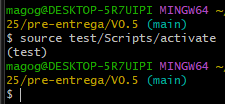

# 🧪 Trabajo Final – Gestor de Productos

 [](https://github.com/MagoGaro/TalentoTech-Python-2025)   

---

## 📦 Descripción

**Gestor de Productos** es una aplicación de consola escrita en Python. Permite gestionar productos mediante operaciones básicas como agregar, listar, buscar, editar y eliminar. A partir de la versión 0.4 incluye persistencia de datos en archivos, y desde la versión 0.5 incorpora mejoras visuales con `colorama` y edición de productos.

---

## 🚀 Funcionalidades

- ✅ Agregar productos
- 📃 Listar productos
- 🕵️ **Buscar productos** *Proximamente*
- 📝 **Editar productos** *(desde V0.5)*
- 🗑️ Eliminar productos
- 🔒 Validación básica de entrada de datos

---

## 🗂️ Tabla de Versiones

| Versión | Detalle                                                             |
|---------|---------------------------------------------------------------------|
| 0.1     | Versión básica                                                      |
| 0.2     | Mejoras y correcciones iniciales                                   |
| 0.3     | Se agregan diccionarios y uso de funciones                         |
| 0.4     | Modularización y persistencia en archivo JSON                      |
| 0.5     | Se integra Colorama y se agrega funcionalidad para editar productos |

---

## 🛠 Instalación de dependencias

> ⚠️ Para versiones como la **V0.5**, se recomienda usar un **entorno virtual**.

### 1. Crear el entorno virtual

```bash
python -m venv test
```
📌 En algunos sistemas puede usarse python3 o py en lugar de python.

### 2. Activar el entorno

```bash
# En Windows
test\Scripts\activate

# En macOS/Linux
source test/bin/activate
```
✔️ Deberías ver el nombre del entorno al inicio de la línea de comandos: (test)

🖼️ Vista previa
Comprobación visual del entorno virtual activo:
<br>

  
  ### 3. Instalar dependencias

  ```bash
pip install -r requirements.txt
```

📄 Licencia
Este proyecto está bajo una **licencia de uso libre** con fines educativos. Podés usarlo, modificarlo y compartirlo siempre y cuando menciones al autor.

✍️ Autor
- Gabriel Sebastián Román